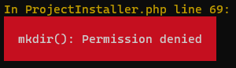
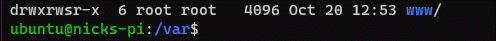
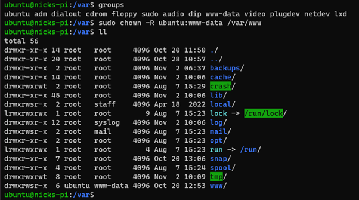
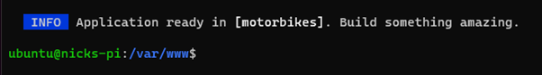

Once my raspberry pi was up and running, see my post: [Setting up a Rasberry Pi](https://blog.nickpaterson.dev/posts/setting-up-a-rasberry-pi), with PHP and MySql already installed it was time to get started with Laravel.

Laravel is a popular PHP web application framework, created by [Taylor Otwell](https://twitter.com/taylorotwell). Laravel is known for its elegant and expressive syntax, which simplifies common web development tasks, making it easier and more efficient to build web applications.

To get started, I needed Composer, a PHP package manager.  Composer is a crucial tool for Laravel development as it simplifies the process of managing the projects dependencies.

Installing Composer is as simple as one command in the project’s terminal.

```php composer-setup.php --install-dir=bin --filename=composer```

To access Composer globally, the following command moves the composer file to the /usr/local/bin directory.

```mv composer.phar /usr/local/bin/composer```

With Composer installed, the next step was to install the Laravel installer globally, a command line tool that simplifies the process of creating new Laravel projects, by using the following command:

```laravel new project-name```


At this point I was encounted an error: mkdir(): Permissions denied



Using linux `ll` command to list the names of the files, with permissions  and groups information.  I saw that the www folder was owned by the root user, which was denying Laravel access to create a new directory in the www directory.



I created a www-data group and changed the owner using linux `chown` command.



Typing in the `laravel new project` again! This time it worked! I have successfully created a Laravel project, hosted on my Raspberry Pi.


