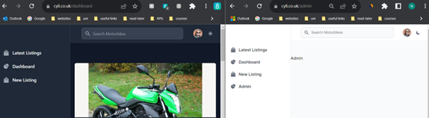

## Setting up the administrative rights

From reading the [Laravel Middleware docs]( https://laravel.com/docs/10.x/middleware), the initial setup involved creating the middleware file, `php artisan make:middleware AdminMiddleware`,  which created the file in `Http/Middleware/AdminMiddleware.php`, and implementing logic to ensure a user had admin privileges. Registering the file was a required step within the `App/Http/Kernel.php` file.

I added in code to the function created from the template provided, to check if the user is an admin:
```
<?php

namespace App\Http\Middleware;

use Closure;
use Illuminate\Http\Request;
use Symfony\Component\HttpFoundation\Response;

class AdminMiddleware
{
    /**
     * Handle an incoming request.
     *
     * @param  \Closure(\Illuminate\Http\Request): (\Symfony\Component\HttpFoundation\Response)  $next
     */
    public function handle(Request $request, Closure $next): Response
    {
        // Check if the user has an is_admin role
        if ($request->user() && $request->user()->is_admin) {
            return $next($request);
        }
        return redirect('/')->with('error', 'Unauthorised Access');
    }
}
```
Code Block 1: Admin Middleware file


Figure 1: AdminController does not exist


The error was due to me using:
` use app\Http\Controllers\AdminController;`
App need to be a capital
` use App\Http\Controllers\AdminController;`
I was now getting an error that it was expecting a different return type:


Figure 2: Return value must be of type View


I removed the `: view` from the function return type
```
class AdminController extends Controller
{
    public function index()
    {
        return view('admin/index');
    }
}
```
Code Block 2: index function, return type removed


It was now working 😊


Figure 3: Admin page in browser


I wanted to add a link onto the sidebar for the, the Laravel Breeze had access to `@guest` and `@auth`.
```
          @admin
          <li>
             <a href="/admin" class="flex items-center p-2 text-gray-900 rounded-lg dark:text-white hover:bg-gray-100 dark:hover:bg-gray-700 group">
                <svg class="w-5 h-5 text-gray-500 transition duration-75 dark:text-gray-400 group-hover:text-gray-900 dark:group-hover:text-white" aria-hidden="true" xmlns="http://www.w3.org/2000/svg" fill="currentColor" viewBox="0 0 22 21">
                   <path d="M16.975 11H10V4.025a1 1 0 0 0-1.066-.998 8.5 8.5 0 1 0 9.039 9.039.999.999 0 0 0-1-1.066h.002Z"/>
                   <path d="M12.5 0c-.157 0-.311.01-.565.027A1 1 0 0 0 11 1.02V10h8.975a1 1 0 0 0 1-.935c.013-.188.028-.374.028-.565A8.51 8.51 0 0 0 12.5 0Z"/>
                </svg>
                <span class="ml-3">Admin</span>
             </a>
          </li>
          @endadmin
```
Code Block 3: Custom blade @admin directive


After some Googling, I needed to add in a Service Provider, using [Laravel Service Providers Docs](https://laravel.com/docs/10.x/providers)
I created an AdminServiceProvider using Artisan ` php artisan make:provider AdminServiceProvider`
```
public function boot()
    {
        Blade::if('admin', function () {
            return auth()->check() && auth()->user()->is_admin;
        });
    }
```
Code Block 4: Custom blade @admin directive set up


I also added this service provider in the list of `ServiceProviders` in the `config/app.php` file:
```
'providers' => ServiceProvider::defaultProviders()->merge([
App\Providers\AdminServiceProvider::class,
    ])->toArray(),
```
Code Block 5: AdminServiceProvider added to the list of Service Providers


This was working, the dark mode browser is a user, and the light mode browser is an admin user, with the extra admin link on the sidebar.


Figure 4: Two browsers, user view and admin view


## Conclusion

As soon as I started I was faced with errors, from silly case sensitive mistakes, and return types, despit these challenges the creation of the Admin Rights as evidenced by the screenshot. The desire to incorporate an admin link on the sidebar spurred exploration into Laravel Breeze's @guest and @auth directives.  Also writing this, I did further research and it turns out I could have used the default `AppServiceProvier.php` file, rather than creating my own.  However, I learn't how it is implemented.


