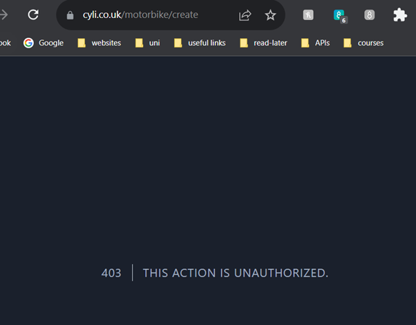
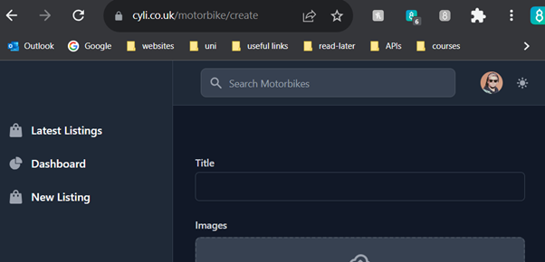
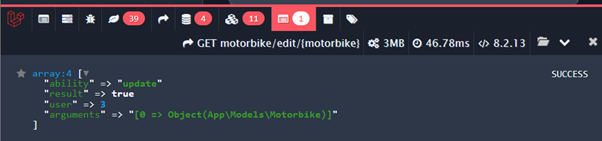

## Creating a CRUD operations policy

From reading the [Laravel Policies]( https://laravel.com/docs/10.x/authorization#creating-policies) and the from the lab slides.
Policies are classes are used to handle authorisation checks related to Eloquent models.  I will be making a policy for Create, Read, Update and Delete (CRUD) operations on the motorbikes table,
The initial setup involved generating a Motorbike Policy using Artisan ` php artisan make:policy MotorbikePolicy`

This needs to be registered in the ` App\Providers\AuthServiceProvider`

I included the `Motorbike` model and Policy and registered the policy:
`use App\Models\Motorbike;`
`use App\Policies\MotorbikePolicy;`

```
    protected $policies = [
        Motorbike::class => MotorbikePolicy::class
    ];
```
Code Block 1: Policy added the to list of polices in the AuthServiceProvider file


I adding the following code to the `MotorbikePolicy.php` file
```
    public function create(User $user) {
        return $user!==null;
    }

    // anyone can read
    public function read(User $user) {
        return true;
    }

    // the user must be the owner
    public function update(User $user, Motorbike $motorbike) {
        return $user->id === $motorbike->user_id;
    }

    // the user must be the owner
    public function delete(User $user, Motorbike $motorbike) {
        return $user->id === $motorbike->user_id;
    }

```
Code Block 2: Create function inside the MotorbikePolicy File


To test this new policy, in the `motorbike.php` routes file I moved the ` Route::get('/motorbike/create', [MotorbikeController::class, 'create']);` out of the ` Route::middleware('auth')->group`. And added the middleware check `->middleware('can:create,App\Models\Motorbike')`


Figure 1: Motorbike page 403 error (Unauthorized response)


I logged in as a user, and got the motorbike upload form



Figure 2: Motorbike page 200 (Ok response)


As this was working, I updated all the CRUD motorbikes operations to
```
Route::get('/listings', [MotorbikeController::class, 'index'])->middleware('can:read,User');
Route::get('/motorbikes/{slug}', [MotorbikeController::class, 'show'])->middleware('can:read,User');

Route::middleware('auth')->group(function () {
    Route::get('/motorbike/create', [MotorbikeController::class, 'create'])->middleware('can:create,User,Motorbike');
    Route::post('/motorbike/create', [MotorbikeController::class, 'store'])->middleware('can:create,User,Motorbike')->name('motorbike.store');
    Route::get('/motorbike/edit/{slug}', [MotorbikeController::class, 'edit'])->middleware('can:update,User,motorbike')->name('motorbike.edit');
    Route::put('/motorbike/edit/{slug}', [MotorbikeController::class, 'update'])->middleware('can:update,User,Motorbike')->name('motorbike.update');
    Route::delete('/motorbike/{motorbike}', [MotorbikeController::class, 'destroy'])->middleware('can:delete,User,Motorbike')->name('motorbike.destroy');
});
```
Code Block 3: Motorbike Routes file


The first check I made was to see if a user could still edit their own motorbikes, which they could not! I had done something wrong!
Looking back at the documentation, I seen further down that you can generate a policy for a given class, so I renamed my old policy and created a new one.
`php artisan make:policy MotorbikePolicy --model=Motorbike`

I was still getting the same issue, eventually I realised that it was due to the motorbike slug being passed through the URL rather than the motorbike id.
```
Route::get('/motorbike/edit/{motorbike}', [MotorbikeController::class, 'edit'])->middleware('can:update,motorbike')->name('motorbike.edit');
Route::put('/motorbike/edit/{slug}', [MotorbikeController::class, 'update'])->middleware('can:update,User,Motorbike')->name('motorbike.update');
```
Code Block 4:  Motorbike object passed in, instead of the motorbike slug


When I updated all the relevant code to pass in the motorbike id, a user can only access the update form if the motorbike belongs to them.
Although the update wasn’t working, even though I had change the code for this too.
I had downloaded a [debug helper](https://github.com/barryvdh/laravel-debugbar) earlier, when loading the edit form in the Gate was showing that there a motorbike being pass in as an argument:


Figure 3: Laravel Debugbar get resquest returning a motorbike object

However, when I was submitting the form, it was just the id


Figure 4: Laravel Debugbar get resquest returning a motorbike id


After a while of trying to debug this, I decided to remove the middleware check for now! I also had to change more code for the `update` method in the `MotorbikeController` to work again!
The Delete seems to work, even with the middleware check! So, I do need to work out what the difference between the motorbike (the id) in the url getting passed in vs in via the form.


## Conclusion

The process of creating a CRUD operations policy for the motorbikes table in Laravel is underway, marked by successful authorisation checks and ongoing debugging efforts to ensure consistent object passing. As the journey progresses, attention remains on refining the update functionality and resolving any lingering discrepancies in the authorisation process later.
