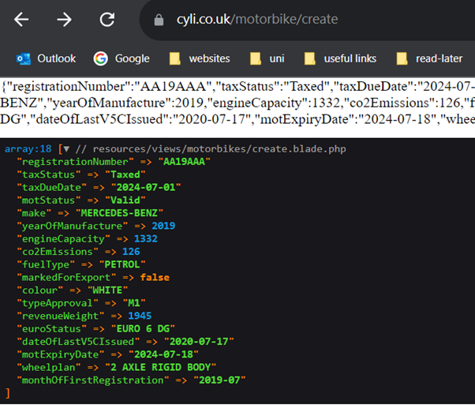

## Vehicle Enquiry Service (VES) API

I initiated the integration of DVLA's Vehicle Enquiry Service (VES) API into my application by obtaining the necessary API key. Following this, I explored the API documentation and implemented a PHP example from the DVLA's documentation.

```
<?php
$curl = curl_init();

curl_setopt_array($curl, array(
  CURLOPT_URL => "https://driver-vehicle-licensing.api.gov.uk/vehicle-enquiry/v1/vehicles",
  CURLOPT_RETURNTRANSFER => true,
  CURLOPT_ENCODING => "",
  CURLOPT_MAXREDIRS => 10,
  CURLOPT_TIMEOUT => 0,
  CURLOPT_FOLLOWLOCATION => true,
  CURLOPT_HTTP_VERSION => CURL_HTTP_VERSION_1_1,
  CURLOPT_CUSTOMREQUEST => "POST",
  CURLOPT_POSTFIELDS =>"{\n\t\"registrationNumber\": \"AA19AAA\"\n}",
  CURLOPT_HTTPHEADER => array(
    "x-api-key: REPLACE WITH YOUR API KEY",
    "Content-Type: application/json"
  ),
));

$response = curl_exec($curl);

curl_close($curl);
echo $response;
?>
```
Code Block: VES PHP Example


Using the env file to load in my API key: I was getting a system error
`Call to undefined function curl_init()`

After making sure I had curl installed, and a lot of googling, and enabling the curl extension in the `php.ini` file nothing was working.

After creating a `phpinfo` file I seen that php was still loading the configuration files from php8.1.
I used the linux command `sudo a2dismod php8.1`  and restarted Apache.
Whoo! I was no longer getting that error.

`{"message":"Forbidden"}` was my new error.

I looked at my emails to make sure I had copied over the correct API key, and they had sent me two emails, one with a TEST API key which was the key I was using, changing it to the other API key I got back the following response:

```
{"registrationNumber":"AA19AAA","taxStatus":"Taxed","taxDueDate":"2024-07-01","motStatus":"Valid","make":"MERCEDES-BENZ","yearOfManufacture":2019,"engineCapacity":1332,"co2Emissions":126,"fuelType":"PETROL","markedForExport":false,"colour":"WHITE","typeApproval":"M1","revenueWeight":1945,"euroStatus":"EURO 6 DG","dateOfLastV5CIssued":"2020-07-17","motExpiryDate":"2024-07-18","wheelplan":"2 AXLE RIGID BODY","monthOfFirstRegistration":"2019-07"}
```
Code Block: VES JSON Response


For further testing, I created a DvlaController using Artisan.
I moved all the code into the new controller,
```
class DvlaController extends Controller
{
    public function index()
    {
        return view('pages/dvla-test');
    }

    public function getVehicleInfo(Request $resquest, $registration)
    {
        $curl = curl_init();

        curl_setopt_array($curl, array(
        CURLOPT_URL => "https://driver-vehicle-licensing.api.gov.uk/vehicle-enquiry/v1/vehicles",
        CURLOPT_RETURNTRANSFER => true,
        CURLOPT_ENCODING => "",
        CURLOPT_MAXREDIRS => 10,
        CURLOPT_TIMEOUT => 0,
        CURLOPT_FOLLOWLOCATION => true,
        CURLOPT_HTTP_VERSION => CURL_HTTP_VERSION_1_1,
        CURLOPT_CUSTOMREQUEST => "POST",
        CURLOPT_POSTFIELDS =>"{\n\t\"registrationNumber\": \"$registration\"\n}",
        CURLOPT_HTTPHEADER => array(
            "x-api-key: " . $_ENV['DVLA_API_KEY'],
            "Content-Type: application/json"
        ),
        ));
        $response = curl_exec($curl);
        curl_close($curl);

        return view('pages/dvla-test', [
            'dvla-json' => $response,
        ]);
    }
}

```
Code Block: DVLA Controller Class


Changed the routes
```
Route::get('/dvla-test', [DvlaController::class, 'index']);
Route::put('/dvla-test', [DvlaController::class, 'getVehicleInfo'])->name('dvla-test.getVehicleInfo');
```
Code Block: Routes to the dvla test page


And created a simple form to post data too.
```
<x-app-layout>
  <div class="sm:m-64">
    <form method="POST" action="{{ route('dvla-test.getVehicleInfo') }}" class="p-6">
      <label for="registration">Registration Number:</label>
      <input id="registration" type="text" name="registration" />

      <div class="pt-6">
        <x-primary-button>
            {{ __('Get Details') }}
        </x-primary-button>
      </div>
  </div>
</x-app-layout>
```
Code Block: Form information


Testing this I got back an error: `The POST method is not supported for route dvla-test. Supported methods: GET, HEAD, PUT.`

I forgot to add the @csrf and @method('put') at the top of the form.  I was still getting the same error, so I changed the route to `Route::post()` and removed the @method(‘put’).
Now I was getting too few arguments to function, so I removed the $registration argument, I was still getting issues with this, so changing the syntax around and still getting nowhere.  When I looked at my form, I noticed I forgot to add a closing tag to the `<form>!

First I dd($request), and got back the following information:
```
Illuminate\Http\Request {#37 ▼ // app/Http/Controllers/DvlaController.php:16
  +attributes: Symfony\Component\HttpFoundation\ParameterBag {#42 ▶}
  +request: Symfony\Component\HttpFoundation\InputBag {#38 ▼
    #parameters: array:2 [▼
      "_token" => "biWUKgGvbNKkcFWFrEup4OyhUF5H8jhSbXKrALuH"
      "registration" => "AA19AAA"
    ]
  }
```
Code Block: Debug and Die (DD) for the request


I was getting the registration, changing the code a little to display the information if I was information in the ‘dvlaJSON’ variable. I got back information and displayed it on the page.


Figure 1: JSON response from DVLA's VES API

I copied some of the form elements from the motorbike create form, and trying to get the information into the input values was challenging:
```
 @if (!empty($dvlaJSON))
              <x-text-input id="make" class="block mt-1 w-full" type="text" name="make" value="{{$dvlaJSON['make']}}" required autofocus />
            @else
              <x-text-input id="make" class="block mt-1 w-full" type="text" name="make" :value="old('make')" required autofocus />
            @endif
```
Code Block: Input values of the JSON data


I was getting back TypeError Cannot access offset of type string on string.
After changing the code in the `DvlaController to decode the JSON data before passing it to the index page:
```
        $response = curl_exec($curl);
        curl_close($curl);

        $dvlaData = json_decode($response, true);

        return view('pages/dvla-test', [
            'dvlaData' => $dvlaData,
        ]);
```
Code Block:  DvlaController file return json decode data


Figure 2: JSON Data inserted into input field

It was working! Although, the DVLA doesn’t hold information about the model! So That will need to be filled in manually by the user!
Time to try it on the real form 🤞
I changed the `DvlaController` to return back with the DVLA data
```
return back()->with([
            'dvlaData' => $dvlaData,
        ]);
```
Code Block: Dvla Controller return back() not working


However, I wasn’t receiving any information, after some research via google I found out that I had to flash the data back via the `MotorbikeController`
```
    public function create(Request $request) : View
    {
        $categoryController = new CategoryController();
        $categories = $categoryController->findAll();

        $dvlaData = $request->session()->get('dvlaData');

        return view('motorbikes/create', [
            'categories' => $categories,
            'request' => $request,
            'dvlaData' => $dvlaData,
        ]);
    }
```
Code Block:  Motorbike Controller Flash the data


It was working!


Figure 3: Debug and Die (DD) JSON response

Whoo! It is working, these values were inserted using the data retrieved from the DVLA Vehicle API 😊


Figure 4: Data in input field inserted by the JSON Response from VES


## Conclusion

The technical issues I had such as PHP configuration errors and API key discrepancies. Despite challenges, the successful integration of the DVLA API into my application demonstrated the importance of troubleshooting and adapting code to dynamic situations.

The process from obtaining the API key to implementing dynamic form data retrieval reflects the pragmatic approach needed in web development, where problem-solving and practical adjustments are crucial for successful API integration.
