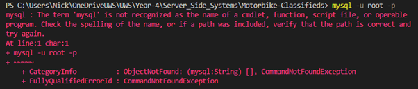
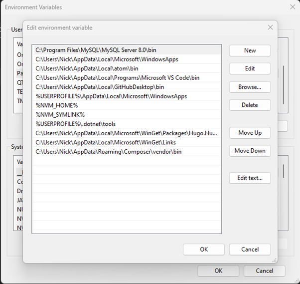
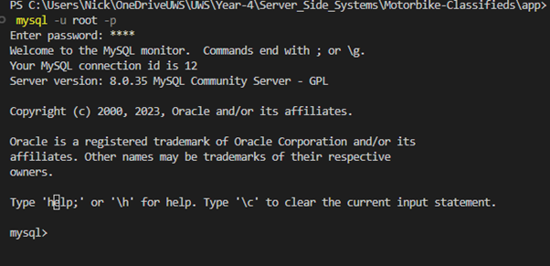
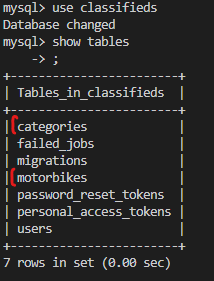
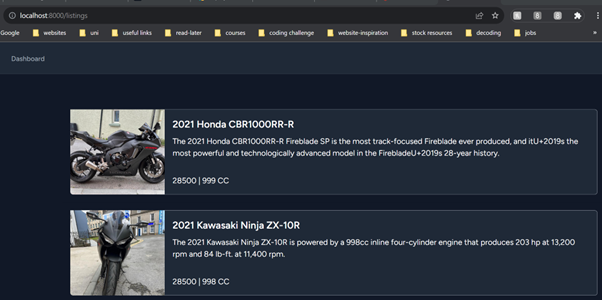

The creation of a motorbike listings page was both an exciting and educating journey.

As I was working locally, I had to install MySQL, after installing MySQL I initially had connection issues, as I must have installed MySQL previously and had forgotten my root password.  After a long Google search and frustration with technical blogs full of jargon that didn’t help, I finally came across a YouTube video that explained the process of resetting your root password and had a step-by-step process.  [Reset-your-MySQL-password]( https://www.youtube.com/watch?v=rr_hDJLFvQE).
However, I was still having issues with logging into MySQL via my project’s terminal.



However, this was solved by updating the Path in Window’s environment variables



Fixed! :D


Laravel makes it easy to control and manage database schema, providing a convenient way to modify database tables. Using the following command:
```php artisan make:migration create_motorbikes_table```
This created a file in the ```database/migrations``` directory.
I added the following code in file it created: inside the `public function up()` function:
```
Schema::create('motorbikes', function (Blueprint $table) {
            $table->id();
            $table->timestamps();
            $table->timestamp('published_at')->nullable();
            $table->foreignId('user_id');
            $table->foreignId('category_id');
            $table->string('title');
            $table->string('thumbnail_url');
            $table->text('description');
            $table->text('summary', 500);
            $table->string('slug');
            $table->string('make');
            $table->string('model');
            $table->string('engine');
            $table->string('year');
            $table->integer('price');

        });
```
Next, I created the Motorbike model using `php artisan make:model Motorbike`
When the ```php artisan migrate``` is executed Laravel will create the `motorbikes` table in the configured database, and then using the `Motorbike` model allowing me to interact with this this table.
I went through the same process to create a categories table: ` php artisan make:migration create_categories_table` and ` php artisan make:model Category`
```
Schema::create('categories', function (Blueprint $table) {
            $table->id();
            $table->timestamps();
            $table->string('category');
        });
```

Executing the following command applies these changes to the database, executing the `up()` method:
```php artisan migrate```



When making changes to these files you can use the `fresh` command `php artisan migrate:fresh`
This executes the `down()` method for the last batch of migrations. Deleting the tables and then recreating them, also deleting all the data. For development I solved this problem by including some dummy data in the `DatabaseSeeder.php` file in the `/database/seeders` directory.
```
\App\Models\Category::create([
            'category' => 'Sport'
        ]);

        \App\Models\Motorbike::create([
            'title' => '2021 Honda CBR1000RR-R',
            'thumbnail_url' => 'https://www.motorcycle.com/blog/wp-content/uploads/2020/02/021020-2021-Honda-CBR1000RR-R-Fireblade-SP-1.jpg',
            'description' => 'The 2021 Honda CBR1000RR-R Fireblade SP is the most track-focused Fireblade ever produced, and itU+2019s the most powerful and technologically advanced model in the FirebladeU+2019s 28-year history. The CBR1000RR-R Fireblade SP is powered by a new 999cc inline four-cylinder engine that produces 214 hp at 14,500 rpm and 83 lb-ft. at 12,500 rpm. The engine is mated to a six-speed cassette-type gearbox.',
            'summary' => 'The 2021 Honda CBR1000RR-R Fireblade SP is the most track-focused Fireblade ever produced, and itU+2019s the most powerful and technologically advanced model in the FirebladeU+2019s 28-year history.',
            'slug' => '2021-honda-cbr1000rr-r',
            'make' => 'Honda',
            'model' => 'CBR1000RR-R',
            'engine' => '999',
            'year' => '2021',
            'price' => '28500',
            'user_id' => 11,
            'category_id' => 1
        ]);

        \App\Models\Motorbike::create([
            'title' => '2021 Kawasaki Ninja ZX-10R',
            'thumbnail_url' => 'https://www.motorcycle.com/blog/wp-content/uploads/2020/11/111020-2021-Kawasaki-Ninja-ZX-10R-1.jpg',
            'description' => 'The 2021 Kawasaki Ninja ZX-10R is powered by a 998cc inline four-cylinder engine that produces 203 hp at 13,200 rpm and 84 lb-ft. at 11,400 rpm. The engine is mated to a six-speed cassette-type gearbox. The ZX-10R is equipped with a Showa Balance Free Fork and Balance Free Rear Cushion shock, both of which are fully adjustable. The ZX-10R is equipped with a Bosch six-axis IMU that controls the Kawasaki Cornering Management Function, Kawasaki Launch Control Mode, Kawasaki Traction Control, Kawasaki Intelligent anti-lock Brake System, Kawasaki Engine Brake Control, and Kawasaki Quick Shifter.',
            'summary' => 'The 2021 Kawasaki Ninja ZX-10R is powered by a 998cc inline four-cylinder engine that produces 203 hp at 13,200 rpm and 84 lb-ft. at 11,400 rpm.',
            'slug' => '2021-kawasaki-ninja-zx-10r',
            'make' => 'Kawasaki',
            'model' => 'Ninja ZX-10R',
            'engine' => '998',
            'year' => '2021',
            'price' => '28500',
            'user_id' => 11,
            'category_id' => 1
        ]);
```
So now I can execute the following command `php artisan migrate:fresh –seed`, which will drop all tables, recreate them and fill them with my data from the seeders file.


I also created relationships, between the tables, using `Laravel’s Eloquent` relationships.
Each instance of a `Motorbike` will belong to a single `User` and belong to a single `Category`.  So, in the `Motorbike.php` in the `/Models` directory, I added the following methods:
```
public function user()
    {
        return $this->belongsTo(User::class);
    }

    public function category()
    {
        return $this->belongsTo(Category::class);
    }
```

Finally, it was time to make the listing page.
In the main routes file `/routes/web.php` I added the following code:
```
Route::get('/listings', function () {
    return view('pages/listings', [
        'motorbikes' => Motorbike::all()
    ]);
});

Route::get('/motorbikes/{motorbike}', function (Motorbike $motorbike) {
    return view('pages/motorbike', [
        'motorbike' => $motorbike
    ]);
});
```

The first line imports the Motorbike model, so the code knows where to find the model.
When a user inputs the /listings endpoint in the URL the code will fetch all the motorbikes and return them to the `listings.blade.php` file in the `/resources/views/pages` directory.
This file now has access to a variable called `motorbikes` that contains all the motorbikes received.
```
<x-app-layout>
    @foreach ($motorbikes as $motorbike)
    <a href="/motorbikes/{{$motorbike->id}}">
        <div class=" w-full lg:max-w-full lg:flex shadow-sm p-4">
        <div
            class="h-48 lg:h-auto lg:w-48 flex-none bg-cover rounded-t-md lg:rounded-t-none lg:rounded-l-md text-center overflow-hidden bg-center"
            style="background-image: url('{{$motorbike->thumbnail_url}}')" title="Mountain">
        </div>
        <div class="border-r border-b border-l border-gray-400 lg:border-l-0 lg:border-t lg:border-gray-400 bg-white dark:bg-gray-800 rounded-b-md lg:rounded-b-none lg:rounded-r-md p-4 flex flex-col justify-between leading-normal">
            <div class="mb-8">
            <div class="text-gray-900 dark:text-white font-bold text-xl mb-2">{{$motorbike->title}}</div>
            <p class="text-gray-700 dark:text-white text-base">{{$motorbike->summary}}</p>
            </div>
            <div class="flex-row items-center dark:text-white">
                <p>{{$motorbike->price}} | {{$motorbike->engine}} CC</p>
            </div>
        </div>
        </div>
    </a>
    @endforeach
</x-app-layout>
```


