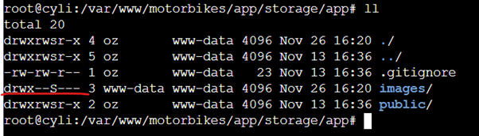
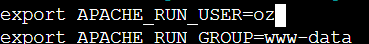
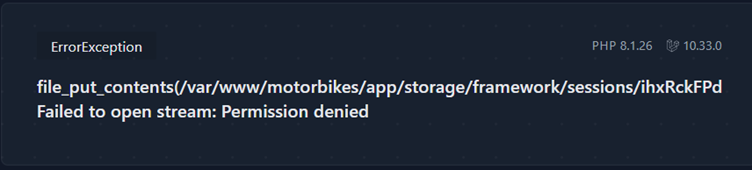
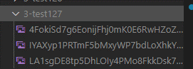
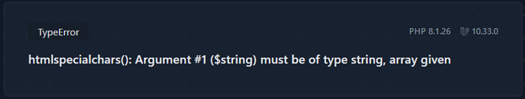

When my raspberry pi had crashed before and I had flashed a new operating system on to the SD, however, when I tried to access it again, I had the same issues. Due to how unreliable it was proving to be I decided to take a different approach.
I already have my personal portfolio website hosted on Digital Ocean droplet and a spare domain that I have, I thought I would make use of it for this project.
The main issue was that MySql was not working, this has been something that I have been meaning to get around to fixing for months. The issue was due to it trying to update and being stuck on a locking loop.
```
2023-11-26T11:02:34.590617Z 4 [System] [MY-013381] [Server] Server upgrade from '80034' to '80035' started. 2023-11-26T11:03:24.678528Z 4 [ERROR] [MY-013178] [Server] Execution of server-side SQL statement 'EXECUTE stmt; ' failed with error code = 1205, error message = 'Lock wait timeout exceeded; try restarting transaction'. 2023-11-26T11:03:24.681876Z 0 [ERROR] [MY-013380] [Server] Failed to upgrade server.
```
After hours of debugging, and all the potential solutions online, required to sign in to MySql, but I couldn’t even start the server.  I ended up uninstalling MySql to reinstall it.
Once MySql was installed again. When trying to install phpMyAdmin and enabling mbstring I was getting the following errors:
```
sudo phpenmod mbstring WARNING: Module mbstring ini file doesn't exist under /etc/php/8.1/mods-available WARNING: Module mbstring ini file doesn't exist under /etc/php/8.1/mods-available
```
However, using the grep command to search for the mbstring I could see that it did exist, so I was very confused why it wasn’t working.


After more hours spent on going through error logs and Googling the solution was simple, the command for installing the mbstring extension had to be more specific.
```
sudo apt-get -y install php8.1-mbstring
```
The command to enable this mod then worked.
```sudo phpenmod mbstring```

I finally had a working LAMP Stack! I could then start the process of configuring Apache to .update the domain to the new directory I was going to create the Laravel app.
Installing Laravel and Laravel Breeze, I had similar permission issues I had last time I installed it, however this time I knew how to fix them and I copied the files from my local directory, updated the environment variables such as the `APP_URL=https://cyli.co.uk` and inputting MySQL database, username and password.  The application was up and running on the live server 😊.
The only thing that wasn’t working was the motorbike uploader, I was getting the following error message:


To fix this I updated the form action to: ` route('motorbike.store')` and the `motorbike.php` routes file to

``` Route::post('/motorbike/create', [MotorbikeController::class, 'store'])
    ->middleware(['auth', 'verified'])
    ->name('motorbike.store');
```
Which solved the issue.
However, my images were not saving, after looking at the images directory the code was trying to save the images to, there was a permission issue!



Forms submitted by the user, was saving new files and directories as the www-data user.  I updated the apache envvar configuration file to make the user oz:



Now I have MORE permission issues!




I updated the permissions to this directory:


Yes! Finally the images are now saving!



New error!!



```
Route::get('/motorbikes/{slug}', [MotorbikeController::class, 'show']);
```
```
public function show($slug): View
    {
        $motorbike = Motorbike::where('slug', $slug)->firstOrFail();

        return view('pages/motorbike', [
            'motorbike' => $motorbike,
            'images' => json_decode($motorbike->images)
        ]);
    }
```


