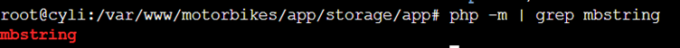
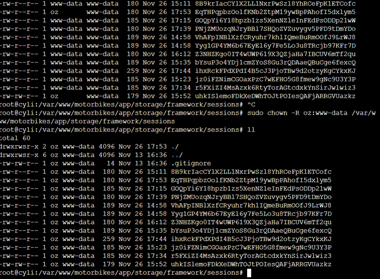

## Hosting with Digital Ocean Droplet (Virtual Machine)

When my raspberry pi had crashed before and I had flashed a new operating system on to the SD, however, when I tried to access it again, I had the same issues. Due to how unreliable it was proving to be I decided to take a different approach.
I already have my personal portfolio website hosted on Digital Ocean droplet and a spare domain that I have, I thought I would make use of it for this project.
The main issue was that MySql was not working, this has been something that I have been meaning to get around to fixing for months. The issue was due to it trying to update and being stuck on a locking loop.

```
2023-11-26T11:02:34.590617Z 4 [System] [MY-013381] [Server] Server upgrade from '80034' to '80035' started. 2023-11-26T11:03:24.678528Z 4 [ERROR] [MY-013178] [Server] Execution of server-side SQL statement 'EXECUTE stmt; ' failed with error code = 1205, error message = 'Lock wait timeout exceeded; try restarting transaction'. 2023-11-26T11:03:24.681876Z 0 [ERROR] [MY-013380] [Server] Failed to upgrade server.
```
Code Block 1: SQL Locking loop


After hours of debugging, and all the potential solutions online, required to sign in to MySql, but I couldn’t even start the server, to log in!  I ended up uninstalling MySql to reinstall it.
Once MySql was installed again. When trying to install phpMyAdmin and enabling mbstring I was getting the following errors:
```
sudo phpenmod mbstring WARNING: Module mbstring ini file doesn't exist under /etc/php/8.1/mods-available WARNING: Module mbstring ini file doesn't exist under /etc/php/8.1/mods-available
```
Code Block 2: Warning message: mbstring ini file doesn exist


However, using the grep command to search for the mbstring I could see that it did exist, so I was very confused why it wasn’t working.


Figure 1: Linux grep command to look for mbstring

After more hours spent on going through error logs and Googling. The solution was simple, the command for installing the mbstring extension had to be more specific.
`sudo apt-get -y install php8.1-mbstring`

The command to enable this mod then worked.
```sudo phpenmod mbstring```

I finally had a working LAMP Stack! I could then start the process of configuring Apache to update the domain to the new directory where I was going to create the Laravel app.

Installing Laravel and Laravel Breeze, I had similar permission issues I had last time I installed it, however this time I knew how to fix them and I copied the files from my local directory, updated the environment variables such as the `APP_URL=https://cyli.co.uk` and inputting MySQL database, username and password.

The application was up and running on the live server 😊.
The only thing that wasn’t working was the motorbike uploader, I was getting the following error message:


Figure 2:  Route [motorbike/create.store] not defined

To fix this I updated the form action to: ` route('motorbike.store')` and the `motorbike.php` routes file to

``` Route::post('/motorbike/create', [MotorbikeController::class, 'store'])
    ->middleware(['auth', 'verified'])
    ->name('motorbike.store');
```
Code Block 3: ->name('motorbike.store') add to the end of the Route

Which solved the issue. However, my images were not saving, after looking at the images directory the code was trying to save the images to, there was a permission issue!


Figure 3: Storage permissons


Forms submitted by the user, was saving new files and directories as the www-data user.  I updated the apache envvar configuration file to make the user oz:


Figure 4: Apache run user

Now I have MORE permission issues!


Figure 5: Permission Errors

I updated the permissions to this directory:


Figure 6: Updated permissions

Yes! Finally the images are now saving!


Figure 7: Images saving in the Laravel storage folder

New error!!


Figure 8: TypeError htmlspecialchar()

### 5/12/2023 Update:
Reading this back when adding captions to images and code blocks, I realised that this blog was unfinished and my blogging improved as time went on, however eventually I solved all the issues with hours (DAYS 😂) of problem solving and debugging!

## Conclusion

 The experience of hosting a Laravel application on a Digital Ocean Droplet showcased the blend of development, server management, and debugging skills required for successful deployment. The challenges encountered, documented, and overcome contribute to a richer understanding of the Laravel framework and the complexities involved in deploying web applications in a live environment.
